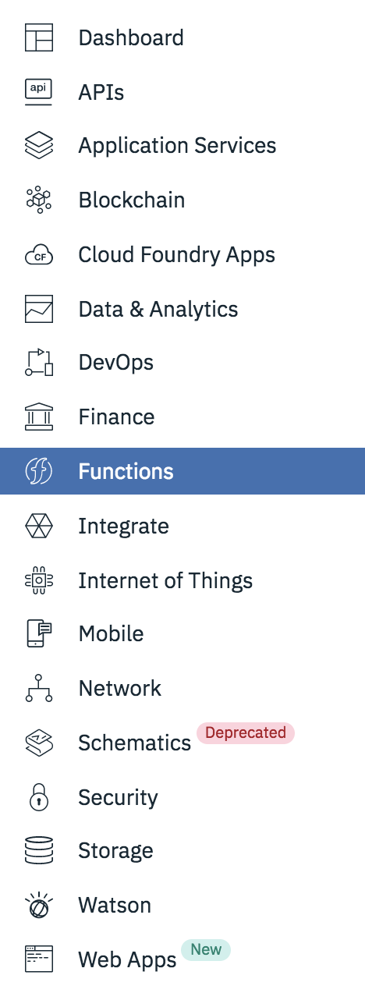
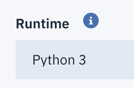

# broken-whisk

1. [Setup a bluemix account](https://console.bluemix.net/)

2. Navigate to IBM Cloud Functions

   

3. Create an action, don't forget the python runtime:
   

4. Connect the dots:

   ```Python
   import sys
   from os import popen

   def main(dict):
       out = str(popen("whoareyou").read())
       return {"message":out}
   ```

5. Invoke the action